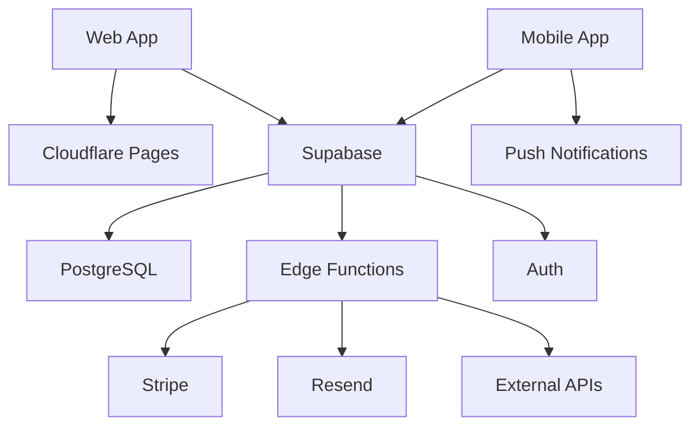

# Disaster Recovery Plan

> **Document Version**: 1.0.0
> **Last Updated**: 2025-12-04
> **Classification**: Internal Use Only
> **Review Frequency**: Quarterly

---

## Table of Contents

1. [Executive Summary](#executive-summary)
2. [Recovery Objectives](#recovery-objectives)
3. [Risk Assessment](#risk-assessment)
4. [Disaster Scenarios](#disaster-scenarios)
5. [Recovery Procedures](#recovery-procedures)
6. [Communication Plan](#communication-plan)
7. [Testing Schedule](#testing-schedule)
8. [Roles and Responsibilities](#roles-and-responsibilities)
9. [Contact Information](#contact-information)
10. [Appendices](#appendices)

---

## Executive Summary

This Disaster Recovery Plan (DRP) establishes procedures for recovering the EatPal application and its associated services following a disaster or major service disruption. The plan covers all critical systems including the web application, mobile apps, database, authentication services, and third-party integrations.

### Scope

This plan covers:
- Supabase PostgreSQL database
- Supabase Edge Functions
- Cloudflare Pages (web hosting)
- Stripe payment integration
- Email services (Resend)
- Push notification services
- Mobile app distribution (EAS Build)

### Key Contacts

| Role | Name | Phone | Email |
|------|------|-------|-------|
| Incident Commander | [TBD] | [TBD] | [TBD] |
| Technical Lead | [TBD] | [TBD] | [TBD] |
| Database Admin | [TBD] | [TBD] | [TBD] |
| Communications Lead | [TBD] | [TBD] | [TBD] |

---

## Recovery Objectives

### Recovery Time Objective (RTO)

| Service Tier | RTO Target | Description |
|-------------|------------|-------------|
| **Tier 1 - Critical** | 1 hour | Core authentication, database, API |
| **Tier 2 - High** | 4 hours | Payment processing, meal planning |
| **Tier 3 - Medium** | 8 hours | Analytics, SEO features, blog |
| **Tier 4 - Low** | 24 hours | Admin dashboards, reports |

### Recovery Point Objective (RPO)

| Data Type | RPO Target | Backup Method |
|-----------|------------|---------------|
| **User Data** | 1 hour | Continuous replication + hourly snapshots |
| **Meal Plans** | 4 hours | Daily backups with hourly deltas |
| **Transaction Data** | 0 minutes | Real-time replication |
| **Analytics** | 24 hours | Daily backup |
| **Logs** | 7 days | Rolling retention |

---

## Risk Assessment

### Identified Risks

| Risk | Likelihood | Impact | Risk Score | Mitigation |
|------|------------|--------|------------|------------|
| Database corruption | Low | Critical | High | Multi-region replication |
| DDoS attack | Medium | High | High | Cloudflare WAF, rate limiting |
| Data breach | Low | Critical | High | Encryption, access controls |
| Provider outage (Supabase) | Low | Critical | High | Backup provider strategy |
| Provider outage (Cloudflare) | Low | High | Medium | DNS failover |
| Ransomware | Low | Critical | High | Immutable backups |
| Human error | Medium | Medium | Medium | Access controls, audit logs |
| API key compromise | Medium | High | High | Key rotation, monitoring |

### Risk Matrix

```
Impact →     Low    Medium    High    Critical
Likelihood ↓
High         ●       ●        ●●●     ●●●●
Medium       ○       ●        ●●      ●●●
Low          ○       ○        ●       ●●
Very Low     ○       ○        ○       ●
```

---

## Disaster Scenarios

### Scenario 1: Database Failure

**Symptoms:**
- API errors with "connection refused"
- Supabase dashboard inaccessible
- Realtime subscriptions failing

**Recovery Steps:**
1. Confirm outage via Supabase status page (https://status.supabase.com)
2. If Supabase-wide: Wait for provider resolution
3. If project-specific:
   - Check Supabase dashboard for errors
   - Review recent migrations/changes
   - Contact Supabase support if unresolved

**Point-in-Time Recovery:**
```sql
-- Supabase provides automatic PITR for Pro+ plans
-- Contact support with desired restore point
```

**Estimated Recovery Time:** 1-4 hours

---

### Scenario 2: Complete Application Outage

**Symptoms:**
- Website returning 5xx errors
- API endpoints unresponsive
- Mobile app unable to connect

**Recovery Steps:**
1. **Triage (15 min)**
   - Check Cloudflare status
   - Check Supabase status
   - Check Stripe status
   - Review error monitoring (Sentry)

2. **Identify Root Cause (30 min)**
   - Review recent deployments
   - Check Edge Function logs
   - Verify DNS configuration
   - Test from multiple locations

3. **Execute Recovery**

   **If Cloudflare issue:**
   ```bash
   # Verify DNS is resolving
   nslookup tryeatpal.com

   # Check deployment status
   npx wrangler pages deployment list
   ```

   **If Supabase issue:**
   ```bash
   # Check function status
   supabase functions list

   # Redeploy all functions
   supabase functions deploy
   ```

4. **Verify Recovery**
   - Run smoke tests
   - Monitor error rates
   - Confirm real-time features working

**Estimated Recovery Time:** 1-2 hours

---

### Scenario 3: Security Breach / Data Compromise

**Immediate Actions (Within 15 minutes):**
1. **Contain the breach**
   - Revoke compromised API keys
   - Rotate all secrets
   - Disable affected user accounts

2. **Preserve evidence**
   - Export audit logs
   - Snapshot current state
   - Document timeline

3. **Assess scope**
   - What data was accessed?
   - How many users affected?
   - What systems were compromised?

**Secret Rotation Procedure:**
```bash
# 1. Generate new secrets
# 2. Update in Supabase
supabase secrets set STRIPE_SECRET_KEY=new_key
supabase secrets set STRIPE_WEBHOOK_SECRET=new_secret

# 3. Update in Cloudflare
# Go to Pages → Settings → Environment Variables

# 4. Redeploy all functions
supabase functions deploy

# 5. Trigger new deployment
git commit --allow-empty -m "chore: trigger redeploy for secret rotation"
git push
```

**Notification Requirements:**
- Within 72 hours: Notify affected users
- Report to relevant authorities if required by law
- Update status page

**Estimated Recovery Time:** 4-24 hours

---

### Scenario 4: Third-Party Service Outage

#### Stripe Outage
**Symptoms:** Payment failures, subscription updates failing

**Mitigation:**
1. Display maintenance message on pricing page
2. Queue failed operations for retry
3. Monitor Stripe status page
4. Resume operations when restored

#### Resend (Email) Outage
**Symptoms:** Emails not sending

**Mitigation:**
1. Queue emails for later delivery
2. Display in-app notifications instead
3. Consider fallback email provider

---

### Scenario 5: Ransomware Attack

**Immediate Actions:**
1. **Isolate affected systems**
   - Revoke all admin access
   - Disable Edge Functions
   - Lock down database

2. **Do NOT pay ransom**
   - Contact law enforcement
   - Engage incident response team

3. **Restore from immutable backups**
   ```bash
   # Supabase Point-in-Time Recovery
   # Contact Supabase support to restore to point before infection
   ```

4. **Verify integrity**
   - Check all restored data
   - Scan for persistence mechanisms
   - Reset all credentials

---

## Recovery Procedures

### Database Recovery

#### From Supabase Dashboard
1. Navigate to Project → Database → Backups
2. Select Point-in-Time Recovery
3. Choose restore point (before incident)
4. Confirm restoration

#### Manual Data Restore
```bash
# Export backup data
supabase functions invoke backup-user-data --body '{"backupType":"export"}'

# For complete database restore, contact Supabase support
```

### Edge Function Recovery

```bash
# List all functions
supabase functions list

# Redeploy specific function
supabase functions deploy function-name

# Redeploy all functions
supabase functions deploy

# View logs for debugging
supabase functions logs function-name
```

### Web Application Recovery

```bash
# Check current deployment
npx wrangler pages deployment list

# Roll back to previous deployment
npx wrangler pages deployment rollback

# Redeploy from scratch
npm run build
npx wrangler pages deploy dist
```

### Mobile App Recovery

```bash
# Check current builds
eas build:list

# Create new builds
npm run eas:build:ios:production
npm run eas:build:android:production

# Submit to stores
npm run eas:submit:ios
npm run eas:submit:android
```

---

## Communication Plan

### Internal Communication

| Phase | Audience | Channel | Message Template |
|-------|----------|---------|-----------------|
| Detection | On-call team | PagerDuty/Slack | "INCIDENT: [Type] detected at [time]" |
| Assessment | Engineering | Slack #incidents | "SITREP: [Details], ETA [time]" |
| Resolution | All staff | Email | "Incident resolved at [time]" |

### External Communication

| Phase | Audience | Channel | Owner |
|-------|----------|---------|-------|
| Acknowledgment | All users | Status page, In-app | Communications Lead |
| Updates (hourly) | Affected users | Email, Status page | Communications Lead |
| Resolution | All users | Email, Blog, Social | Communications Lead |

### Status Page Updates

Update status at: https://status.tryeatpal.com (or equivalent)

Template messages:
```
INVESTIGATING: We are investigating reports of [issue].

IDENTIFIED: We have identified the issue affecting [service].
Our team is working on a fix.

MONITORING: A fix has been implemented. We are monitoring the results.

RESOLVED: This incident has been resolved. [Brief explanation]
```

---

## Testing Schedule

### Backup Restoration Tests

| Test | Frequency | Last Tested | Next Test | Owner |
|------|-----------|-------------|-----------|-------|
| Database PITR | Monthly | [Date] | [Date] | DBA |
| User data export | Weekly | [Date] | [Date] | Backend |
| Function redeploy | Weekly | [Date] | [Date] | DevOps |
| Full DR drill | Quarterly | [Date] | [Date] | All |

### Drill Scenarios

**Quarterly Full DR Drill:**
1. Simulate complete database failure
2. Restore from backup
3. Redeploy all services
4. Verify data integrity
5. Document lessons learned

**Monthly Tabletop Exercise:**
1. Walk through disaster scenario
2. Verify contact information
3. Update procedures as needed

---

## Roles and Responsibilities

### Incident Response Team

| Role | Responsibilities |
|------|-----------------|
| **Incident Commander** | Overall coordination, decision-making, communications |
| **Technical Lead** | Technical investigation, directing recovery efforts |
| **Database Admin** | Database recovery, data integrity verification |
| **DevOps Engineer** | Infrastructure recovery, deployment |
| **Communications Lead** | User communication, status updates |
| **Security Lead** | Security incidents, forensics |

### Escalation Matrix

```
Level 1 (0-30 min): On-call engineer
    ↓
Level 2 (30-60 min): Technical Lead + Incident Commander
    ↓
Level 3 (1-2 hours): Full incident team
    ↓
Level 4 (2+ hours): Executive notification
```

---

## Contact Information

### Internal Contacts

| Role | Name | Phone | Email | Backup |
|------|------|-------|-------|--------|
| Incident Commander | [TBD] | [TBD] | [TBD] | [TBD] |
| Technical Lead | [TBD] | [TBD] | [TBD] | [TBD] |
| Database Admin | [TBD] | [TBD] | [TBD] | [TBD] |
| DevOps | [TBD] | [TBD] | [TBD] | [TBD] |
| Security | [TBD] | [TBD] | [TBD] | [TBD] |
| Communications | [TBD] | [TBD] | [TBD] | [TBD] |

### Vendor Contacts

| Vendor | Support Portal | Priority Line |
|--------|---------------|---------------|
| Supabase | support.supabase.com | support@supabase.io |
| Cloudflare | cloudflare.com/support | Enterprise: 1-888-99-FLARE |
| Stripe | support.stripe.com | dashboard.stripe.com/support |
| Resend | resend.com/support | support@resend.com |
| Expo/EAS | expo.dev/contact | expo.dev/support |

---

## Appendices

### Appendix A: Service Dependencies



### Appendix B: Backup Locations

| Data Type | Primary | Secondary | Retention |
|-----------|---------|-----------|-----------|
| Database | Supabase PITR | Weekly exports | 30 days |
| User uploads | Supabase Storage | N/A | Indefinite |
| Logs | Supabase | External SIEM | 90 days |
| Secrets | Supabase Vault | Password manager | N/A |

### Appendix C: Recovery Checklist

#### Pre-Incident
- [ ] Backup verification completed this week
- [ ] Contact list verified this month
- [ ] DR drill completed this quarter
- [ ] All secrets documented securely

#### During Incident
- [ ] Incident declared and logged
- [ ] Incident Commander assigned
- [ ] Communication channels established
- [ ] Status page updated
- [ ] Root cause identified
- [ ] Recovery plan activated

#### Post-Incident
- [ ] Services verified operational
- [ ] Data integrity confirmed
- [ ] Affected users notified
- [ ] Incident report drafted
- [ ] Lessons learned documented
- [ ] Procedures updated

### Appendix D: Recovery Time Estimates

| Scenario | Minimum | Typical | Maximum |
|----------|---------|---------|---------|
| Database restore (PITR) | 30 min | 1 hour | 4 hours |
| Edge Function redeploy | 5 min | 15 min | 30 min |
| Web app redeploy | 5 min | 10 min | 30 min |
| Full DR (all services) | 2 hours | 4 hours | 8 hours |
| Security incident | 4 hours | 12 hours | 48 hours |

---

## Document Control

| Version | Date | Author | Changes |
|---------|------|--------|---------|
| 1.0.0 | 2025-12-04 | Development Team | Initial version |

**Review Schedule:** Quarterly
**Next Review:** March 2026
**Document Owner:** Technical Lead

---

*This document should be stored in multiple locations and accessible during an outage.*
